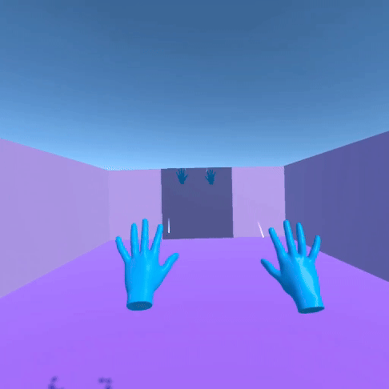
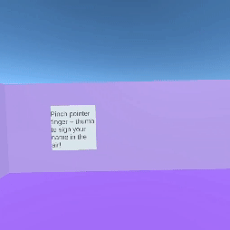

# Immersive-Privacy-and-Security-Awareness
JiHo Lee(jiholee@vt.edu), Carissa Bostian(carissab@vt.edu), Mughees Ur Rehman(mughees@vt.edu)

 As virtual environments (VEs) become more integrated into daily life, users are increasingly exposed to invisible data collection mechanisms, often without full understanding or meaningful consent. This study investigates how immersive and interactive VR experiences can be leveraged to improve user awareness of privacy policies and data collection practices. We designed two types of VR privacy rooms: a mirror-based room with low interactivity and a game-based room with high interactivity—each focusing on eye tracking, emotion tracking, and hand tracking. Through a within subjects study, participants experienced both approaches and were assessed through comprehension quizzes, Likert-scale evaluations, and open-ended feedback. Our results show that the game-based rooms significantly outperformed mirror-based ones in enhancing user understanding, perceived transparency, and caution toward data sharing. Participants in the interactive condition achieved higher quiz scores, reported greater awareness of data tracking, and expressed increased skepticism about third party data use. These findings suggest that integrating privacy education into interactive VR systems can be an effective approach to informing users and empowering informed decision-making in immersive contexts.

<h3>Mirror-Based Implementation</h3>
<li>Eye-Tracking</li>

  

<li>Emotion Tracking</li>

<li>Hand Tracking</li>

  

<h3>Game-Based Implementation</h3>
<li>Eye-Tracking</li>

  

<li>Emotion Tracking</li>

<li>Hand Tracking</li>

  

